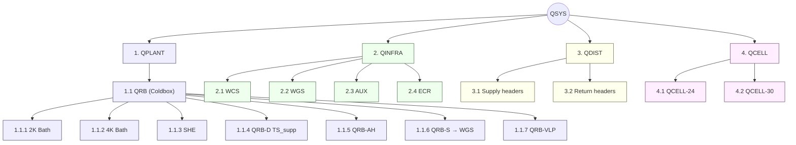
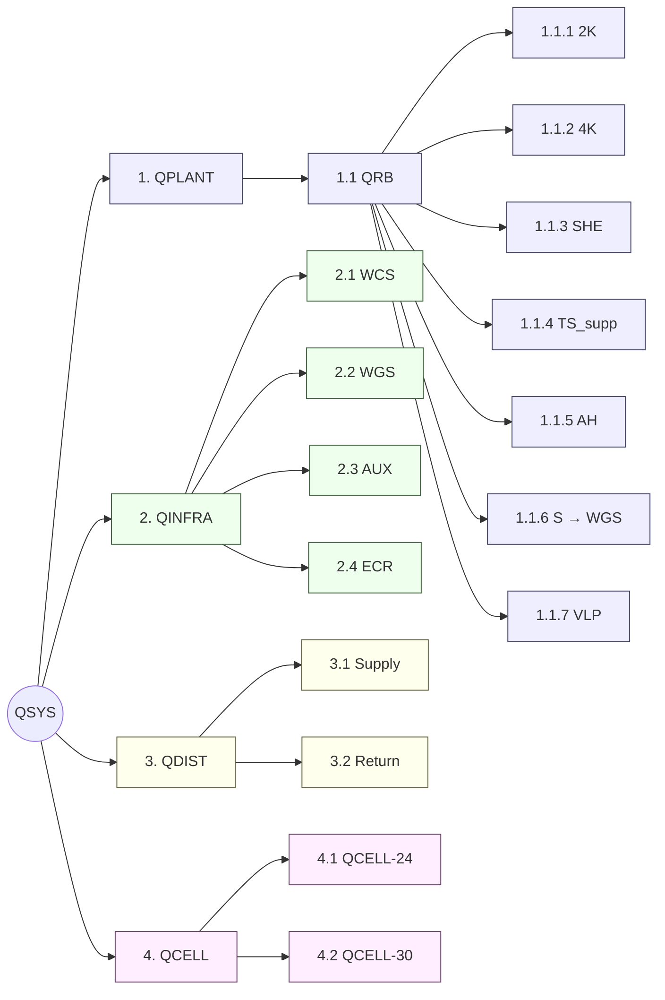
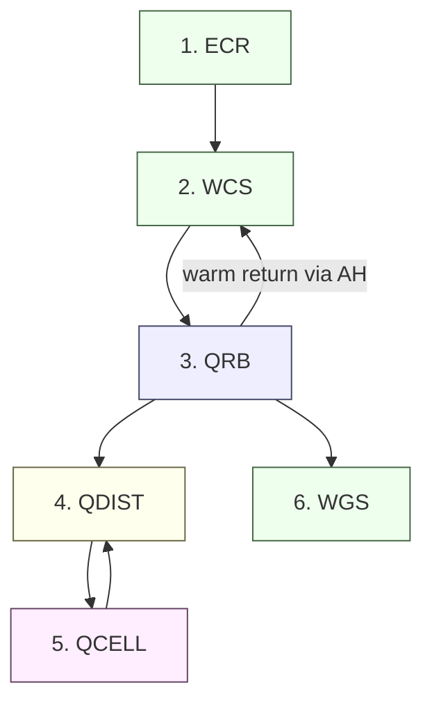
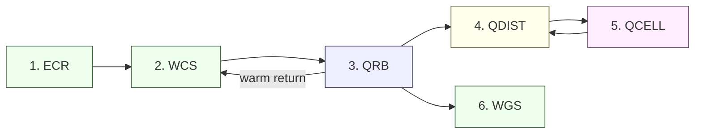

# Scope & Intent

This deliverable provides **System Breakdown Structure (SBS)** and **System Context & Connections Schematic (SCSS)** for **QSYS = QPLANT + QINFRA + QDIST + QCELL**, rendered in both **ASCII** and **Mermaid**. Ancillary contractual “shall” statements are included to anchor interfaces, materials, QA/NDT, electrical, and operating points.

---

## 0) Nomenclature & Conventions (contractual)

* **QSYS** = Overall Cryogenic System.
* **QPLANT** = Cold production block (incl. **QRB** coldbox and embedded sub-systems).
* **QINFRA** = Warm utilities & infrastructure (incl. **WCS** warm compression, **WGS** warm gas storage, electrical, cooling water).
* **QDIST** = Cryogenic distribution (headers, valves, interfaces).
* **QCELL** = Users/cryomodules (e.g., QCELL-24, QCELL-30).
* **QRB** = Coldbox (vacuum vessel) hosting **QRB-2K bath**, **QRB-4K bath**, **SHE** (subcooler heat exchanger), **QRB-D** 30–40 K HP shield supply (**TS_supp**), **QRB-AH** Ambient Heater (warm-return conditioning), **QRB-S** safety vent/recovery to **QINFRA-WGS**, **QRB-VLP** warm sub-atmospheric line (~500 mbar abs).
* **Rooms**: **Coldbox Room** (QRB), **Compressor Room** (WCS) in **CCB**, **ECR** (Electrical Room), **Outside Gas Area** (WGS) between **CCB** and **AUB**.
* **Pressure units**: unless suffixed “g”, pressures are **absolute** (mbar(a), bar(a)). Examples: P₁ ≈ **1050 mbar(a)**; P₂ ≈ **14 bar(g)** = 15 bar(a); compression ratio CR ≈ **15**.
* **Materials**: **SS304L** for helium piping (gas/liquid/superfluid); **SS316** for water/oil circuits (chloride/glycol tolerance).
* **Abbreviation hygiene**: avoid ambiguous “TS”; use **TS_supp** for thermal-shield supply. Ignore spurious/incorrect labels such as “Colocoliacaliuy_(wrong)”.

---

## 1) SBS — System Breakdown Structure

### 1.1 ASCII (A4 portrait, top‑down)

```
QSYS
├─ (1) QPLANT
│  └─ (1.1) QRB (Coldbox; vacuum‑insulated)
│     ├─ (1.1.1) QRB-2K Bath (superfluid He for QCELL cavities)
│     ├─ (1.1.2) QRB-4K Bath (thermal buffer/stabilizer; perturbation damping)
│     ├─ (1.1.3) SHE (Subcooler Heat Exchanger)
│     ├─ (1.1.4) QRB-D : 30–40 K HP shield supply (TS_supp)
│     ├─ (1.1.5) QRB-AH: Ambient Heater (warm return conditioning)
│     ├─ (1.1.6) QRB-S : Safety valves & recovery header → QINFRA-WGS
│     └─ (1.1.7) QRB-VLP: Warm sub‑atmospheric line (~500 mbar(a)) to AH
│
├─ (2) QINFRA
│  ├─ (2.1) WCS (Warm Compression System; Compressor Room, CCB)
│  │  └─ HP1..HP4; Σ ≈ 350 g/s → ~14 bar(g) discharge
│  ├─ (2.2) WGS (Warm Gas Storage; Outside Gas Area): 3 × 120 m³ (vertical)
│  ├─ (2.3) Cooling Water / Oil / N₂ Utilities (AUX)
│  └─ (2.4) Electrical (ECR): ES02 400 V; UPS = TBD; Diesel back‑up = TBD
│
├─ (3) QDIST (Cryo Distribution)
│  ├─ (3.1) Supply headers: 2 K, 4.5 K, 30–40 K (TS_supp)
│  └─ (3.2) Return headers: cold return → QRB-AH / QRB
│
└─ (4) QCELL (Users)
   ├─ (4.1) QCELL-24 (representative)
   └─ (4.2) QCELL-30 (representative)
```

Legend: (1) QPLANT; (2) QINFRA; (3) QDIST; (4) QCELL

### 1.2 ASCII (A4 landscape, left‑to‑right)

```
QSYS → (1) QPLANT → (1.1) QRB → [ (1.1.1) 2K Bath | (1.1.2) 4K Bath | (1.1.3) SHE | (1.1.4) QRB-D (TS_supp) | (1.1.5) QRB-AH |
                                 (1.1.6) QRB-S → WGS | (1.1.7) QRB-VLP ]
     → (2) QINFRA → [ (2.1) WCS HP1..HP4 @ ~14 bar(g) | (2.2) WGS 3×120 m³ | (2.3) AUX | (2.4) ECR ES02 400 V ]
     → (3) QDIST → [ (3.1) Supply headers 2 K / 4.5 K / 30–40 K | (3.2) Return headers → QRB-AH/QRB ]
     → (4) QCELL → [ (4.1) QCELL-24 | (4.2) QCELL-30 ]
```

Legend: items numbered as per portrait diagram; arrows show hierarchical flow left→right.

### 1.3 Mermaid (A4 portrait, top‑down)



Legend: blue = QPLANT; green = QINFRA; yellow = QDIST; pink = QCELL.

### 1.4 Mermaid (A4 landscape, left‑to‑right)



Legend: orientation left→right for landscape display; colors as above.

---

## 2) SCSS — System Context & Connections Schematic

### 2.1 ASCII (A4 portrait, rooms & flows top‑down)

```
[1] ECR ES02 400 V ──> [2] WCS HP1..HP4 (Σ≈350 g/s, Pout≈14 bar(g))
           │                    │
           │                    └───────> Discharge (≈15 bar(a)) → Process loop
           │
           └─(UPS TBD, Diesel TBD)

   ┌─────────────────────────── CCB ────────────────────────────┐
   │                                                           │
   │  Coldbox Room                                Compressor Room│
   │  ┌───────────────┐                           ┌───────────┐ │
   │  │     [3] QRB   │                           │   [2] WCS │ │
   │  │  ┌─────────┐  │                           │  HP1..4   │ │
   │  │  │[3a]2K   │  │                           └───────────┘ │
   │  │  ├─────────┤  │                                     ▲    │
   │  │  │[3b]4K   │  │  Return (cold) via [4] QDIST ───────┘    │
   │  │  ├─────────┤  │        (to [3e] QRB-AH then [2] WCS)     │
   │  │  │[3c]SHE  │  │                                          │
   │  │  ├─────────┤  │ Supply (cold) via [4] QDIST ──> [5] QCELL │
   │  │  │[3d]QRB-D│──┼── 30–40 K TS_supp                        │
   │  │  ├─────────┤  │                                          │
   │  │  │[3e]QRB-AH│<=┼= Warm return conditioning                │
   │  │  ├─────────┤  │                                          │
   │  │  │[3f]QRB-S│─┼─ Safety/recovery header → [6] WGS        │
   │  │  └─────────┘  │                                          │
   │  └───────────────┘                                          │
   └────────────────────────────────────────────────────────────┘

   Outside Gas Area:
      [6] WGS: 3 × 120 m³ (vertical)  ⇐ [3f] QRB-S (relief/recovery)

   [4] QDIST (common distribution corridor):
      Supplies: 2 K, 4.5 K, 30–40 K (TS_supp)  →  [5] QCELL-{24,30,...}
      Returns : from [5] QCELL (cold) → [3e] QRB-AH/[3] QRB (then [2] WCS)

Ownership boundary (warm side): outlet of [3e] QRB-AH; downstream belongs to [2] WCS/[2] QINFRA.

Notes:
  - Sub-atmospheric warm line [3g] QRB-VLP (~500 mbar(a)) ties to AH.
  - Pressures: P1≈1050 mbar(a); P2≈14 bar(g) (≈15 bar(a)); CR≈15.
  - Maintain absolute vs gauge clarity; vacuum risks <1000 mbar(a).
```

Legend: [1] ECR, [2] WCS, [3] QRB, [4] QDIST, [5] QCELL, [6] WGS.

### 2.2 ASCII (A4 landscape, left‑to‑right)

```
[1] ECR → [2] WCS → [3] QRB → [4] QDIST → [5] QCELL
  │          ↑          │           ↑            │
  │      UPS/Diesel     │           │            └─ cold return → [3e] AH → [2]
  │                     │           │
  │                     └─ [3f] S → [6] WGS      │
  │                                   │         supply/return
  └────────────────────────────────────┴─────────────<────────┘
```

Legend: numbers as above; flow arrows run left→right.

### 2.3 Mermaid (A4 portrait, top‑down)



Legend: blue = plant (QRB); green = infrastructure (ECR, WCS, WGS); yellow = distribution; pink = users.

### 2.4 Mermaid (A4 landscape, left‑to‑right)



Legend: orientation left→right; colors as above.

---

## 3) Rationale — Why **2 K** and **4 K** baths (process justification)

1. **2 K Bath (superfluid helium)** shall provide ultra-low temperature, high thermal conductivity and low viscosity for **critical RF cavities**, enabling high **Q₀** stability, fast transient heat extraction, and tight resonance control during dynamic gradients and microphonics.
2. **4 K Bath** shall act as a **thermal buffer** and **perturbation damper** for upstream exchangers and 4.5 K supply stabilization, smoothing load steps from QCELL and **reducing control loop gain** demands on cold compressors.
3. The **dual-bath topology** shall decouple **2 K stability** from **4–5 K plant fluctuations**, lowering risk of cavity trips and minimizing overall exergy destruction.

---
## 4) Interface Ownership & Boundaries (contractual)

* **Warm-side boundary**: The **outlet of QRB-AH** (ambient heater) shall constitute the **SBS ownership boundary**; all **300 K piping downstream** belongs to **WCS/QINFRA**.
* **Cryogenic distribution**: **QDIST** shall own and operate **2 K**, **4.5 K**, and **30–40 K (TS_supp)** headers up to **QCELL** tie-ins; QCELL returns shall interface back to **QDIST** and **QRB-AH/QRB**.
* **Safety & recovery**: **QRB-S** shall route to **QINFRA-WGS** (3×120 m³ vertical tanks) in the **Outside Gas Area**.

---

## 5) Materials & QA/NDT (contractual)

* **Helium circuits** (gas/liquid/superfluid) shall be **SS304L** minimum.
* **Water/oil/glycol circuits** shall be **SS316** to mitigate chloride-induced corrosion and galvanic effects; make-up water shall be **softened** (not DI) to avoid passivation loss and dissociation issues.
* **On-site welds**: **100% radiography (X-ray)**.
* **Factory/Sub-assemblies**: RT (**X-ray**) or **PU/UT** permitted **only** where **100% orbital welding** is applied; deviations require **user-approved exceptions**.
* Orbital welding records (**“line of weld”**), visual inspection and appropriate **NDT** (e.g., dye-penetrant) shall be archived.

---

## 6) Electrical & Utilities (contractual)

* **ES02 400 V** in **ECR** shall supply **four primary outlets (~350 kW each)** and **one 350 kW back-up** feeder for WCS/QRB auxiliaries.
* **UPS** and **Diesel back-up** are **TBD**; locations, ratings, and ATS logic shall be **aligned and co-developed** with facility code and load shedding strategy.
* **Cooling water/glycol** chemistry, flow, and materials compatibility shall be controlled to limit corrosion/degassing risks.

---

## 7) Operating Points & Units (contractual)

* **WCS capacity** shall be **Σ ≈ 350 g/s** high-pressure helium at **~14 bar(g)** (≈ **15 bar(a)**), nominal **P₁ ≈ 1050 mbar(a)**, **CR ≈ 15**.
* **Sub-atmospheric lines** (e.g., **QRB-VLP** ~500 mbar(a)) shall be managed to prevent **air in-leak** and helium inventory loss.
* All documentation shall report **absolute pressures** unless explicitly marked **“g”** for gauge.

---

## 8) To-Be-Determined (TBD) / Alignment Items

* **UPS** rating, autonomy, distribution, and critical load list.
* **Diesel** generator rating, fuel autonomy, ATS sequence.
* **Detailed corrosion control plan** for water/glycol (pH, chloride limits, inhibitors, sampling).
* **Room-by-room** HVAC heat rejection & ODH provisions.
* **QCELL fleet definition** (exact count/states for QCELL-24/-30) and **rate-limiting load** (SHE vs TS_supp).

---

## 9) CSS Definition (for traceability)

* **Cryogenic Supply System (CSS)** = **QPLANT + QINFRA** (including warm return and total outside inventory storage **QINFRA-WGS**).
* CSS shall provide **2 K**, **4.5 K**, and **30–40 K** services via **QDIST** to **QCELL**, with defined return pathways to **QRB-AH/QRB** and compression by **WCS**.

---

### Notes on Use

* The Mermaid blocks can be pasted into GitHub/markdown viewers that support Mermaid for visual rendering.
* The ASCII blocks are sized to fit A4 width in monospaced fonts.

If you want, I can produce **A4-ready PDFs** (portrait/landscape) with these exact diagrams embedded, plus an **abbreviations table** and **interface matrix** for your RTM.
