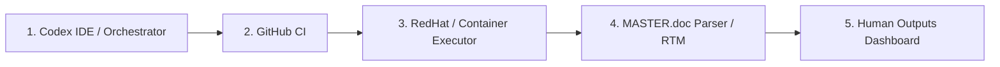

# MCP GUI workflow cross-check

The human-facing GUI enumerates the same five blocks everywhere: cards, Mermaid, JSON API, and Tkinter.

```text
+----------------------+     +----------------------+     +----------------------+
| BLOCK 1 / S1         | --> | BLOCK 2 / S2         | --> | BLOCK 3 / S3         |
| Codex IDE / Orch     |     | GitHub CI            |     | RedHat / Container   |
| source: manifest     |     | source: GitHub/manifest|    | source: manifest     |
+----------------------+     +----------------------+     +----------------------+
                                                                    |
                                                                    v
+----------------------+     +----------------------+
| BLOCK 5 / S5         | <-- | BLOCK 4 / S4         |
| Human Dashboard      |     | MASTER.doc Parser    |
| source: manifest     |     | source: execution    |
+----------------------+     +----------------------+
```



Status semantics are explicit: `PASS`, `FAIL`, `RUNNING`, `PENDING`, `CANCELLED`, `BLOCKED`, `UNKNOWN`. Colour is supplementary only.
